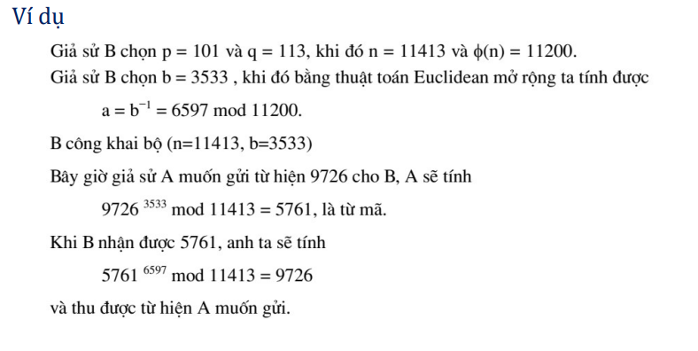

<!-- Tổng quan về mật mã khóa công khai -->
Lịch sử: Ý tưởng về hệ thống mã hóa khóa công khai được Martin Hellman, Ralph Merkle và Whitfield Diffie tại Đại học Stanford giới thiệu vào năm 1976.

Diffie, W.; Hellman, M.E. (November 1976). "New directions in cryptography". IEEE Transactions on Information Theory

Khái niệm:
Mật mã khóa công khai (public-key) là hệ mã không đối xứng, nghĩa là sử dụng hai khóa liên đới cho việc mã hoá và giải mã thay vì một khóa duy nhất như trong các hệ mã cổ điển (hay còn gọi là hệ mã đối xứng). Việc này đáp ứng được các yêu cầu trong các ứng dụng về bảo mật riêng tư, phân phối khóa, và xác thực điện tử.

Lưu ý: Một hệ mật khóa công khai không bao giờ cung cấp độ mật vô điều kiện - thực tế, đó là hàm cửa sập một chiều (a trapdoor one-way function).
<!-- Ý tưởng: -->
Mỗi người dùng: sử dụng một cặp khóa (khóa công khai, khóa bí mật)
khóa công cộng (public key) được công bố rộng rãi và được sử dụng trong mã hóa thông tin
khóa riêng (private key) chỉ do một người nắm giữ và được sử dụng để giải mã thông tin đã được mã hóa bằng khóa công cộng tương ứng

Mã hóa: A muốn gửi thông điệp cho B - mã hóa bằng khóa công khai của B
y = E(e_B, x)

Giải mã: B giải mã bằng khóa bí mật của mình
x = D(d_B, y)

Hàm mã hóa và giải mã có thể đổi chỗ

Các phương pháp mã hóa này khai thác những ánh xạ f mà
Biết x, tính y=f(x) dễ dàng
Biết y, việc thực hiện ánh xạ ngược f –1 tính x là rất khó
Hàm f có tính chất trên thường gọi là hàm một chiều

Ví dụ:
Cho các số nguyên tố p1, p2, ... , pn
Tính N= p1* p2* ... * pn- dễ
Ngược lại, biết N, tìm p1, p2, ... , pn là khó

• Hàm cửa sập (trap door):
• Để xây dựng hệ mã khóa công khai - thường dùng hàm một chiều đặc biệt cótham số/cửa sập:
nếu biết tham số thì tính f –1 dễ dàng
• Hàm cửa sập => xây dựng mật mã khóa công khai
• Hàm mã hóa - là hàm cửa sập
• Khóa (bí mật) - chính là thông tin tham số - bẫy trap door

<!-- Những hệ mật khóa công khai quan trọng nhất -->

RSA: dựa trên độ khó của phép phân tích các số nguyên lớn.

Merkle-Hellman Knapsack: và các hệ liên quan dựa trên độ khó của bài toán subset sum (được biết là NP-complete). Tuy nhiên, có nhiều hệ mật dựa trên bài toán sắp ba lô đã được chứng minh là không bảo mật.

McEliece: dựa trên bài toán giải mã của một mã tuyến tính (cũng được cho là NP-complete).

ElGamal: dựa trên bài toán Logarit rời rạc trên trường hữu hạn.

Chor-Rivest: là một hệ sắp ba lô nhưng được xem là bảo mật.

Elliptic Curve: là sự cải tiến của các hệ mật khác, chẳng hạn tương
tự ElGamal nhưng dựa trên các đường cong elíp thay vì trường hữu
hạn. Ưu điểm của các hệ mật dạng này là có thể duy trì được độ bảo
mật với khóa nhỏ hơn thông thường.

<!-- Hệ mật RSA -->
Hệ mật RSA, được phát triển bởi Ron Rivest, Adi Shamir và Leonard Adleman (1977), có thể được sử dụng trong bảo mật dữ liệu và công nghệ chữ ký điện tử.

Bảo mật của RSA dựa trên giả thuyết không có các thuật toán đủ nhanh để khai triển luỹ thừa một số. Qui trình áp dụng RSA gồm hai bước:
1) Lựa chọn (sinh) cặp khóa công khai và khóa bí mật
2) Thực hiện thuật toán mã hoá và thuật toán giải mã

 

<!-- Sinh cặp khóa công khai-bí mật (Bob) -->
1. Chọn hai số nguyên tố đủ lớn, $p$ và $q$ 
2. Tính toán $n = pq$ và $\phi(n) = (p - 1)(q - 1)$ 
3. Chọn một số, $e$ $(1 < e < \phi(n))$ sao cho $\text{gcd}(e, \phi(n)) = 1$. Giá trị $e$ sẽ được sử dụng trong mã hoá \\
4. Tìm một số $d$ sao cho $ed - 1$ chia hết cho $\phi(n)$, hay nói cách khác $d = e^{-1} \mod \phi(n)$. Giá trị $d$ sẽ được sử dụng để giải mã 
5. Công khai khóa $K^+_B$  = (n, e)  và giữ bí mật khóa $K^-_B$  = (n, d) 
<!-- Thuật toán mã hoá (Alice) và thuật toán giải mã (Bob) -->

<!-- Mã hoá (Alice) -->
Giả sử Alice muốn gửi cho Bob một mẫu bit, hoặc một số $m$ sao cho $m < n$. Để mã hoá, Alice thực hiện tính luỹ thừa, $m^e$, sau đó tính toán số dư khi đem chia $m^e$ cho $n$. Vì vậy, giá trị được mã hoá ($c$) của bản tin $m$ là:  $c = m^e \mod n $

<!-- Giải mã (Bob) -->
Để giải mã đoạn tin mã hoá nhận được ($c$), Bob tính toán: $ m = c^d \mod n $

Việc này đòi hỏi phải sử dụng khóa bí mật $(n, d)$.

<!-- Tấn công hệ mã RSA -->
RSA là hệ mật khóa công khai => nên việc tấn công thường dựa vào khóa công khai (n, b) để xác định được khóa bí mật tương ứng (p, q, a)=> Tấn công hiển nhiên là phân tích modulus n để xác định p, q
• Thay vì tìm cách phân tích n, có thể tìm (n)
• Độ khó tìm (n) = (p–1) (q–1) còn lớn hơn việc phân tích n ra thừa số

Là hệ mật khóa công khai
=> thay vì phân tích n, có thể
• Tìm khóa bí mật d=a
Biết các cặp (X, Y): Y=ek(X) => để tìm khóa bí mật: giải phương trình ௔• Tìm bản rõ X khi nghe được bản mã Y
Tìm căn thức đồng dư ௔

Cài đặt không an toàn:
• Sử dụng chung modulus
• Một nhóm nhiều người dùng các khóa công khai (n,e): chung modulus n• Khi đó:
• nếu thu được 2 bản mã Y1, Y2 - mã từ cùng bản rõ X
• các thành phần e1, e2 nguyên tố cùng nhau
thì có cách để giải được bản mã hiệu quả:
• do UCLN (e1, e2) =1 => tìm được a, b để: a*e1+b*e2 = 1
từ đó: ଵ
௔
ଶ
௕ ௔∗௘ଵ ௕∗௘ଶ ௔∗௘ଵା௕∗௘ଶ ଵ
• Khóa công khai (n,e) có thành phần e nhỏ:
• Khóa bí mật (p,q,d) có d nhỏ

<!-- References: -->
https://duckopensource.wordpress.com/crypto/rsa
Slide MM thầy Hân
Slide MM thầy Nam