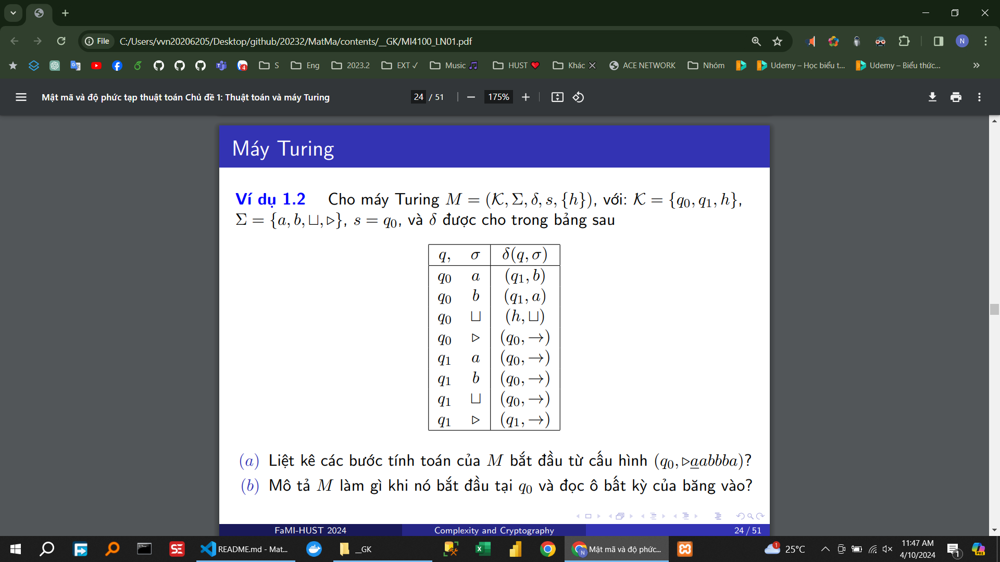
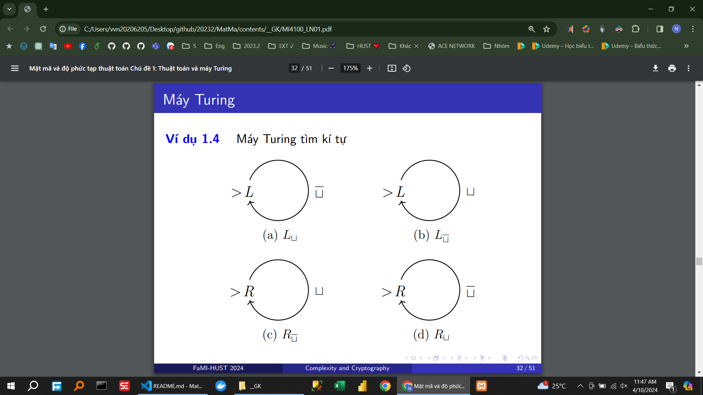

Đề bài Kí hiệu mẫu ...

# Máy xóa xâu kí tự

<!-- # Máy xóa xâu kí tự -->

Máy đối xứng a,b
Máy đối xứng a,b,c
Máy a^n  
Máy a^n b^m c^p
Xây dựng máy Turing tính hàm trừ riêng
Xây dựng máy Turing, dịch xâu trên băng đi 1 ô sang phải

(10)^n

0^n 1^n

0^n 1^m
